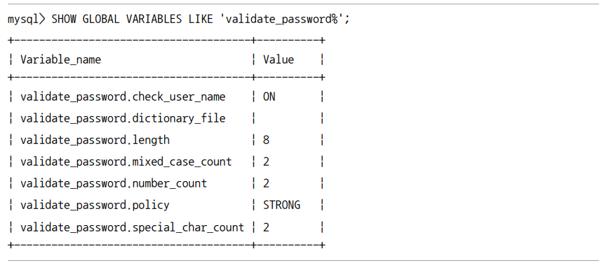
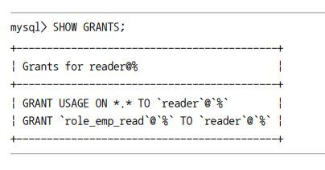

# 3장 사용자 및 권한

## 3.1 사용자 식별

- `사용자 접속 지점`(= 클라이언트가 실행된 `호스트명`, `도메인`, `IP`) = 계정의 일부
- `계정` &rarr; 항상 `아이디` + `호스트` ex) 'root'@'127.0.0.1'
- `%` &rarr; 모든 `IP`, `호스트명` 의미 ex) 'root'@'%'

## 3.2 사용자 계정 관리

### 3.2.1 시스템 계정과 일반 계정

|시스템 계정|일반 계정|
|:-------:|:------:|
|`SYSTEM_USER` 권한 0|`SYSTEM_USER` 권한 X|
|DB 서버 관리자|개발자|

| <div align="center">시스템 계정 권한</div>      |
|:-----------------------------------------|
| 시스템 계정 & 일반 계정 관리(계정 생성, 삭제, 권한 부여 및 제거) |
| 다른 세션(Connection), 세션에서 실행 중인 쿼리 강제 종료   |
| stored 프로그램 생성 시 DEFINER를 타 사용자로 설정      |

|  MySQL 내장 계정   |<div align="center">설명</div>|
|:--------------:|:------|
|   mysql.sys    |`sys 스키마 객체(뷰, 함수, 프로시져)`의 `DEFINER`로 사용되는 계정|
| mysql.session  |MySQL `플러그인`이 서버로 접근할 때 사용되는 계정|
|mysql.infoschema|`information_schema`에 정의된 `뷰의 DEFINER`로 사용되는 계정|

위 계정은 처음부터 잠겨있는 상태로 의도적으로 권한을 풀지 않는 한 보안 걱정 X

## 3.3 비밀번호 관리

### 3.3.1 고수준 비밀번호

<div align="center">
    
</div>

|비밀번호 정책| <div align="center">설명</div>                              |
|:-------:|:------------------------------|
|LOW| 비밀번호 길이만 검증                   |
|MEDIUM| 비밀번호 길이, 숫자와 대소문자, 특수문자 배합 검증 |
|STRONG| MEDIUM 레벨 + 금칙어 포함 여부 검증      |


## 3.5 역할

> 권한을 묶어 역할로 사용

### 1. `role_emp_read`, `role_emp_write` 역할 정의

```mysql
CREATE ROLE 
    role_emp_read,
    role_emp_write;
```

### 2. 역할에 권한 부여

```mysql
GRANT SELECT ON employes.* TO role_emp_read;
GRANT INSERT, UPDATE, DELETE ON employes.* TO role_emp_wrte; 
```

### 3. 계정 생성 후 역할 부여

```mysql
CREATE USER reader@'127.0.0.1' IDENTIFIED BY 'qwerty';
CREATE USER writer@'127.0.0.1' IDENTIFIED BY 'qwerty';

GRANT role_emp_read TO reader@'127.0.0.1';
GRANT role_emp_read, role_emp_write TO writer@'127.0.0.1';
```

### 4. 계정 권한 확인

<div align="center">
    
</div>

### 5. 계정 역할 활성화

#### 수동 설정의 경우

> 수동 설정의 경우 로그아웃 후 재로그인시에 역할이 초기화

```mysql
SET ROLE 'role_emp_read';
```

#### 자동 설정의 경우

> 자동 설정의 경우 activate_all_roles_on_login 시스템 변수 ON

아래 명령어를 통해 매번 SET ROLE 명령으로 역할을 활성화 하지 않아도 **로그인과 동시에 부여된 역할이 자동으로 활성화**

```mysql
SET GLOBAL activate_all_roles_on_login=ON;
```

|테이블|<div align="center">설명</div>|
|:-----:|:----|
|mysql.default_roles|계정별 기본 역할|
|mysql.role_edges|역할에 부여된 역할 관계 그래프|


