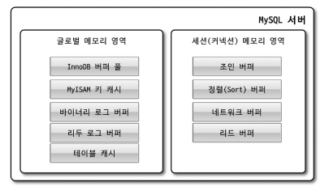

# 4장 아키텍처

## 4.1 MySQL 엔진 아키텍처

> MySQL 서버 = MySQL 엔진 + 스토리지 엔진

### 4.1.1 MySQL 전체 구조

    

#### 4.1.1.1 MySQL 엔진

> 클라이언트로부터 오는 요청 처리(요청된 SQL 문장 분석, 최적화 등)

|특징| 
설명
                                     |
|:------:|:-----------------------------------------------------------------|
|Connection Handler| **Connection 및 쿼리** 요청 처리                                            |
|SQL 인터페이스| `DML`, `DDL`, `Procedure`, `View` 등 SQL 인터페이스 담당                         |
|SQL Parser| SQL **문법 오류** 탐지 + 쿼리 문장을 MySQL이 처리하기 좋은 **토큰 단위로 나눠 트리 형태로 파싱**하는 작업 담당 |
|SQL Optimizer| **쿼리 최적화**된 실행 담당                                                    |
|캐시 & 버퍼| 성능 향상을 위한 보조 저장소 기능 담당                                           |

#### 4.1.1.2 스토리지 엔진

> 실제 데이터를 디스크 스토리지에 저장하거나 조회

- MySQL 엔진과 플러그인 형태로 연동/분리 가능하고 핸들러 API(= 핸들러 요청)을 통해 스토리지 엔진에 읽기/쓰기 요청 가능

### 4.1.2 MySQL 스레딩 구조

> MySQL 스레드 = Foreground 스레드 + Background 스레드

| 
포그라운드 스레드
                           |
백그라운드 스레드
|
|:--------------------------------------------------------------|:-------|
| 클라이언트 및 사용자가 요청한 **쿼리 문장을 처리**하는 스레드                              |insert buffer를 병합하는 스레드|
| **데이터 조회** 스레드   (데이터 버퍼나 캐시 또는 직접 디스크나 인덱스 파일로 접근하여 데이터를 가져오는 스레드 |로그 기록 스레드|
| `thread_cache_size` 설정에 따라 **일정 스레드 개수로 유지**                      | InnoDB 버퍼 풀의 데이터를 디스크로 write하는 스레드                          |
|                                                            | 데이터를 버퍼로 읽어들이는 스레드                                          |
|                                                            | lock, dead lock을 모니터링 하는 스레드                                |
|                                                            | 모든 백그라운드 스레드를 관리하는 메인 스레드                                   |

### 4.1.3 메모리 할당 및 사용 구조

> MySQL 메로리 구조 = `글로벌 메모리 영역` + `로컬 메모리 영역`  
> `글로벌 메모리 영역` = 많은 스레드에 의해 공유되는 영역  
> `로컬 메모리 영역` = 많은 스레드에 의해 공유되지 않는 독립적인 영역

    

### 4.1.6 쿼리 실행 구조

    

|           역할            | 
설명
                                                  |
|:-----------------------:|:------------------------------------------------------------------------------|
|         Parser          | 요청 쿼리에 대해 **syntax를 확인**하고 **쿼리 문장을 적절한 단위로 분할**하여 `parser tree` 만듬                   |
|      Pre-processor      | 앞에서 만들어진 `parser tree`를 보고 구조적으로 문제 있는지 확인   ex) 없는 테이블, 컬럼 등에 접근 or 테이블 접근 권한 |
|        Optimizer        | 요청 쿼리를 어떻게 하면 **가장 적은 비용**으로 **빠르게** 처리할 지 결정                                 |
|          실행 엔진          | `optimizer`에 의해 결정된 **실행 계획대로 핸들러에게 지시**                                          |
| Handler(storage engine) | 실행 엔진이 내려준 **지시대로 작업 수행**                                                         |

## 4.2 InnoDB 스토리지 엔진 아키텍처

